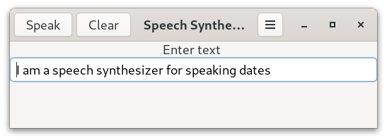

# Diphone Speech Synthesizer

A code example of a diphone speech synthesizer for speaking dates.  It has been developed using C and [GTK4](https://docs.gtk.org/gtk4/) for Linux GTK desktops (GNOME, XFCE etc.). 

A screenshot of the diphone talker is shown below.




## How is Speech Generated?

Words are formed as sequences of elementary speech units. A phoneme is the smallest unit of sound that distinguishes one word from another word and there are 44 phonemes in the English language. A diphone is a sound unit composed of two adjacent partial phonemes i.e. the second half of the first phoneme and the first half of the second phoneme. The synthesizer uses a set of pre-recorded diphone sound samples and concatenates diphone audio to produce speech output for a given text input.

The voice used by Diphone Talker is derivative work based on the diphone collection created by Alan W Black and Kevin Lenzo which is free for use for any purpose (commercial or otherwise) and subject to the light restrictions [detailed here](https://github.com/hypnaceae/DiphoneSynth/blob/master/diphones_license.txt). I have used the same licence for the voice that I have created. There is information about recording your own diphones [here](http://festvox.org/bsv/x2401.html) and in the speech synthesis lecture by Professor Alan W Black [here](https://www.youtube.com/watch?v=eDjtEsOvouM&t=1459s). 


## Sample Phrases

Some sample phrases for speaking dates are shown below

```
Thursday first May

Wednesday twenty fifth December Christmas
```

Pre-processing of input text is very limited at this stage just removing unwanted characters such as commas, exclamation marks and question marks.

## Build From Source

The C source code for the diphone speech synthesizer for reading out dates is provided in the src directory and has been developed using Debian Bookworm which uses GTK 4.8.

[Geany](https://www.geany.org/) can be used as a source code editor for opening, viewing and then compiling the Talk Calendar C code. Geany is lightweight and has an integrated terminal for building the application. To install the Geany IDE use the command below.

```
sudo apt install geany
```
Alternatively, the latest version of Geany can be built from source using autotools.

### Building on Debian Bookworm

To build diphone speech synthesizer from source you need the gcc compiler, GTK4, and GLIB development libraries. You need to install the following packages.

```
sudo apt install build-essential
sudo apt install libgtk-4-dev
sudo apt install libasound2-dev
```

The packages:

```
sudo apt install libglib2.0-dev
sudo apt install alsa-utils
```

are needed but should be installed by default. 

To determine which version of GTK4 is running on a Debian system use the following terminal command.

```
dpkg -l | grep libgtk*
```

Use the MAKEFILE to compile the code. Just run "make" inside the source code folder.

```
make
```

To run the diphone talker from the terminal use

```
./talker
```


## Versioning

[SemVer](http://semver.org/) is used for versioning. The version number has the form 0.0.0 representing major, minor and bug fix changes.

## Author

* **Alan Crispin** [Github](https://github.com/crispinprojects)

## License

The project is licensed under LGPL v2.1. 

## Project Status

Active.

## Acknowledgements

* [Diphone Source and License](https://github.com/hypnaceae/DiphoneSynth/blob/master/diphones_license.txt)

* Diphone collection and synthesis Alan W. Black and Kevin Lenzo [2000](https://www.cs.cmu.edu/~awb/papers/ICSLP2000_diphone.pdf)
